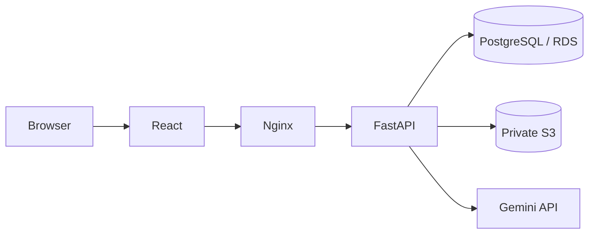
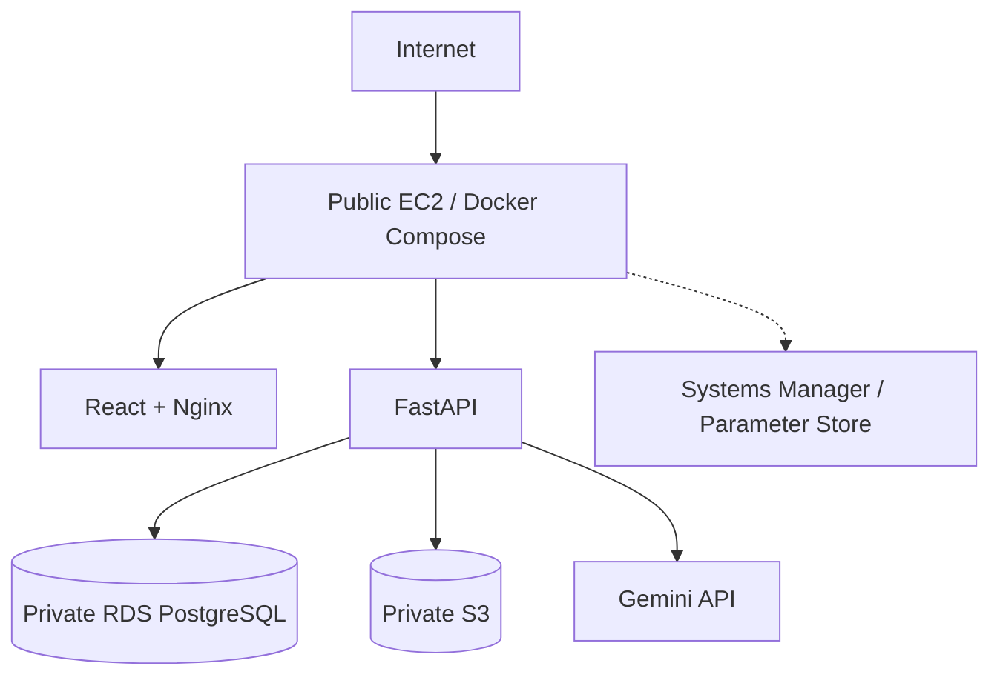

# AI Loan Assessment & Advisory Platform

## Overview
A three-tier web application for loan application intake, deterministic financial assessment, document verification, policy-context retrieval, grounded AI explanation, human advisor review, and auditability.

## Users
- Applicant: register, submit applications, upload documents, view findings, respond to information requests, resubmit.
- Advisor: review applications, inspect evidence/findings, view review risk and policy context, request information, record final APPROVE/REJECT.

## High-Level Architecture

## AWS Phase 1

## Key Highlights
- React + FastAPI + PostgreSQL.
- JWT authentication and applicant/advisor RBAC.
- PDF document validation, extraction and versioning.
- Deterministic financial assessment using credit score, FOIR and LTI.
- Deterministic 0–100 review-risk score.
- LangGraph workflow for verification and advisory orchestration.
- Grounded Gemini explanation with deterministic fallback.
- Human advisor final decision and audit trail.
- Docker Compose.
- Terraform-managed AWS infrastructure and remote state.
- GitHub Actions CI and Terraform validation.

## Decision Boundary
Automated Rule Assessment, verification, review-risk scoring and AI explanation are separate from the Final Advisor Decision. AI explains supplied facts and policy context; it does not make the final lending decision.

## Documentation
- 02_System_Component_Architecture.md
- 03_Data_Model.md
- 04_Application_Workflow_Decision_Engine.md
- 05_Security_RBAC.md
- 06_AWS_Deployment.md
- 07_CI_CD.md
- 08_Testing.md
- 09_Limitations_Future_Scope.md
