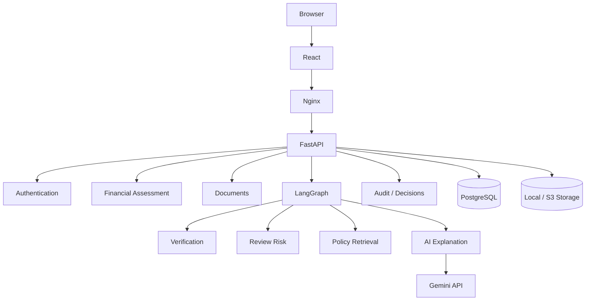
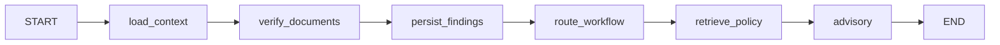

# System & Component Architecture

## Logical Architecture

## Components
### Frontend
React/Vite application. Production build is served by Nginx and uses same-origin API requests.

### Nginx
Serves the React build and proxies /api requests to FastAPI.

### Backend
FastAPI routes cover authentication, applications, documents and advisor operations. Services implement assessment, extraction, verification, risk, retrieval, AI explanation and persistence.

### Database
PostgreSQL stores users, applicants, applications, documents, evidence, verification runs, findings and audit logs.

### Storage
A storage abstraction supports local disk during development and S3 in AWS.

## Active LangGraph

Important: route_workflow computes CONTINUE, HUMAN_REVIEW or REQUEST_INFORMATION, but the current graph edges are linear. The route is returned as workflow state; it is not currently implemented as a conditional LangGraph branch.

The repository also contains older/alternate graph and vector-retrieval services. They are not the active workflow path used by the application.

## Phase 2
EKS, ALB, scaling, stronger observability and production network/security controls are target-state architecture, not the deployed Phase 1 architecture.
