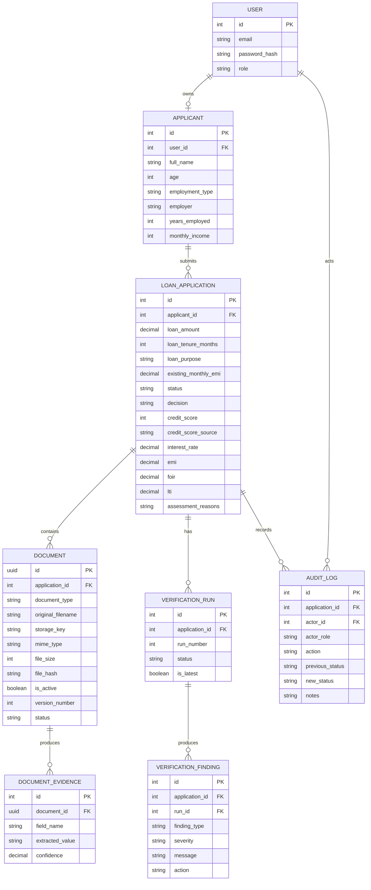

# Data Model

## ERD

## Persistence Principles
- Assessment reasons are separate from the final advisor decision.
- Documents are versioned using hashes, version numbers, active status and storage keys.
- Each verification execution creates a run; historical runs remain preserved.
- Findings belong to a specific verification run.
- Audit logs record actor, role, action, status transition and notes.

## Database Management
Alembic manages schema migrations. The backend currently uses PostgreSQL locally and Amazon RDS in the AWS deployment.
