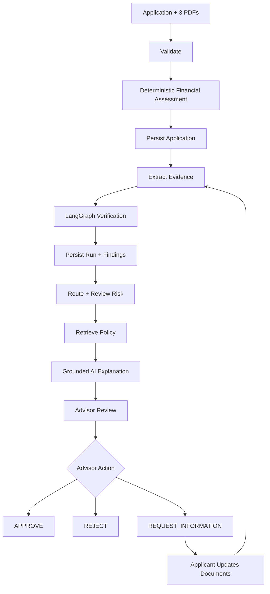

# Application Workflow & Decision Engine

## End-to-End Pipeline

## Financial Assessment
Current configured rules:
| Rule | Threshold |
|---|---:|
| Minimum credit score | 600 |
| Maximum FOIR | 50% |
| Maximum LTI | 5.0 |

EMI is calculated using the standard amortizing-loan formula. FOIR is existing EMI plus proposed EMI divided by monthly income. LTI is loan amount divided by annualized monthly income.

Any failed rule produces automated REJECTED; otherwise automated APPROVED.

Interest rate uses an 8% base rate plus credit-score and loan-purpose adjustments.

## Evidence and Verification
The system extracts evidence from payslips, bank statements and tax returns. Verification checks include name, employer, income, salary-credit matching, tax-return income and payslip/tax-return income.

Missing evidence creates REQUEST_INFORMATION findings.

## Routing
The deterministic routing function returns:
- REQUEST_INFORMATION when required information is missing;
- HUMAN_REVIEW when review findings exist;
- CONTINUE otherwise.

The current LangGraph still proceeds linearly through policy retrieval and advisory generation. The route is surfaced to the application/advisor layer.

## Review-Risk Score
A deterministic 0–100 triage signal:
- credit score: maximum 30;
- FOIR: maximum 30;
- LTI: maximum 20;
- verification findings: maximum 20.

It is not a probability of default, credit score or AI prediction.

## Policy Retrieval
The active workflow uses deterministic keyword-overlap retrieval over local policy Markdown sections. The repository contains embedding/FAISS-related components, but they are not the active retrieval path.

## AI Advisory
Gemini receives structured assessment facts, findings and retrieved policy context. It is instructed not to invent facts, change the assessment or present automated approval as the final human decision.

Output sections:
- summary;
- financial factors;
- policy basis;
- verification context;
- advisor focus.

A deterministic fallback is used when Gemini is unavailable.

## Final Decision
The advisor may APPROVE, REJECT or REQUEST_INFORMATION. Final decisions require notes. Once approved or rejected, another final advisor decision is blocked.

## Resubmission
Information-requested applications can receive replacement documents, rerun evidence extraction and verification, create a new verification run, and return to advisor review without deleting historical findings.
