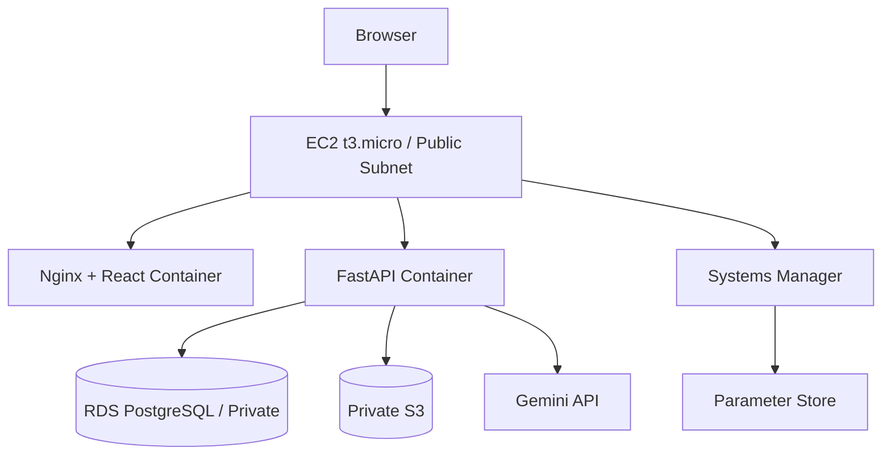
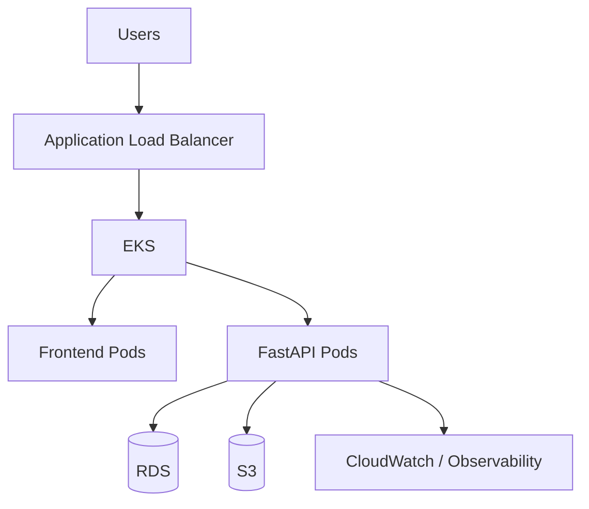

# AWS Deployment

## Phase 1

## Networking
Terraform provisions:
- VPC;
- public application subnet;
- two private DB subnets;
- Internet Gateway;
- public route table;
- RDS DB subnet group.

EC2 has a public IP. RDS is not publicly accessible.

## Compute
Amazon Linux 2023 + Docker + Docker Compose on a t3.micro EC2 instance.

AWS Compose runs React/Nginx and FastAPI. PostgreSQL is provided by RDS.

## RDS
- PostgreSQL 18.
- db.t3.micro.
- 20 GB gp3.
- storage encryption enabled.
- private accessibility.
- budget-controlled backup/deletion settings.

Alembic migrations run during deployment.

## S3
Private versioned S3 bucket stores uploaded loan documents.

## Configuration
The EC2 deployment script retrieves parameters, exports runtime configuration, starts/rebuilds the AWS Compose stack and runs Alembic migrations.

## Terraform
Terraform manages AWS networking, EC2, RDS, S3, security groups, IAM and SSM-related resources. Terraform state is stored remotely in S3.

## Cost Control
Phase 1 intentionally avoids EKS, ALB, NAT Gateway, ECR and multi-instance compute.

## Phase 2 Target

Phase 2 is design/future scope only.
