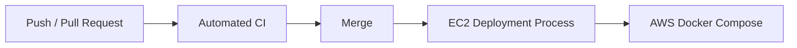

# CI/CD

## Current State
The repository has automated CI and Terraform validation through GitHub Actions. It does not currently contain an automated production deployment workflow.

## Backend CI
Runs on backend changes for pushes to main and pull requests:
1. Python 3.12 setup.
2. Dependency installation.
3. Python compile check.
4. pytest suite.

## Frontend CI
Runs on frontend changes:
1. Node.js 22.
2. npm ci.
3. lint.
4. production build.

## Docker Smoke Test
Builds and starts Docker Compose, waits for PostgreSQL, runs Alembic, checks backend health, checks applicant authentication/application access, checks frontend availability, displays status/logs and tears down the stack.

## Terraform CI
Uses GitHub OIDC, Terraform 1.15.8, fmt check, init, validate and plan. The database password is supplied as a GitHub Actions secret.

## AWS OIDC Test
A manual workflow verifies GitHub Actions can assume the configured AWS IAM role.

## Actual Delivery Flow

Therefore the accurate description is **automated CI + infrastructure validation, with deployment through the EC2 deployment process**, not fully automated CD.

## Future CD
Possible future work:
- immutable image publishing;
- automated deployment;
- environment approvals;
- rollback;
- post-deployment smoke tests.
