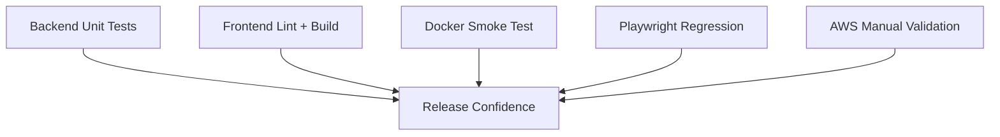

# Testing

## Test Layers

## Backend
Coverage includes assessment, advisor decisions, RBAC, AI explanation, document versioning, evidence extraction, LangGraph workflow, policy retrieval, review-risk scoring, verification runs and routing.

## Frontend
CI validates linting and production build.

## Docker
Smoke tests validate image build, application startup, PostgreSQL readiness, Alembic migrations, backend health, applicant registration/authentication/application access and frontend serving.

## End-to-End
Playwright regression coverage includes:
- authentication;
- successful applications;
- rule rejection;
- advisor approval;
- final-decision locking;
- information requests;
- document replacement/resubmission;
- verification mismatch/human review;
- RBAC.

## AWS Validation
The deployed environment was validated through SSM, Docker Compose, database migration, health checks, browser testing and document processing.

## Latest Verified CI
Commit 4dce8f825094d9ba3555af5d15cfeb2f78fab988:
- Backend CI #33: success.
- Docker Smoke Test #35: success.

The immediately preceding Backend CI failure was caused by a test passing policy context and findings to deterministic_fallback in the wrong order. The test was corrected and the current runs pass.

## Important Correctness Boundary
Tests explicitly protect the rule that an automated APPROVED assessment with review findings must remain HUMAN REVIEW and must not be represented as a final approval recommendation.

## Future Testing
Load testing, security testing, penetration testing, recovery testing and automated deployed-environment smoke tests remain future scope.
